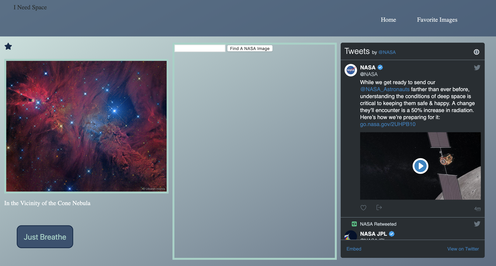
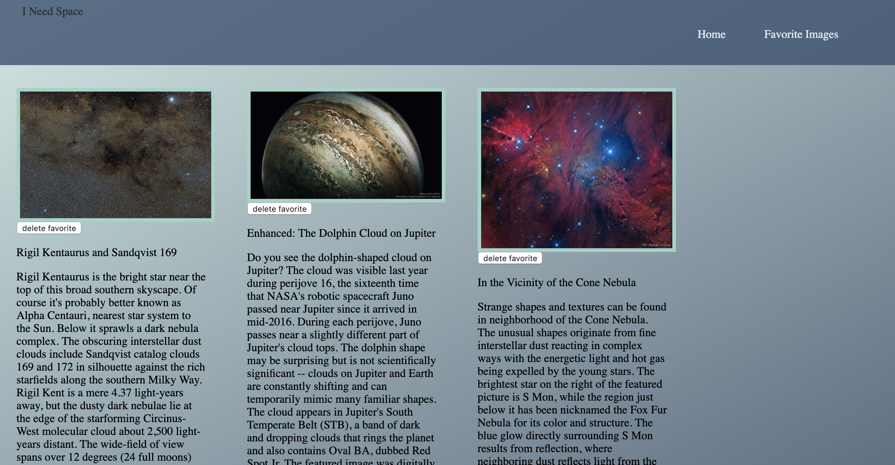
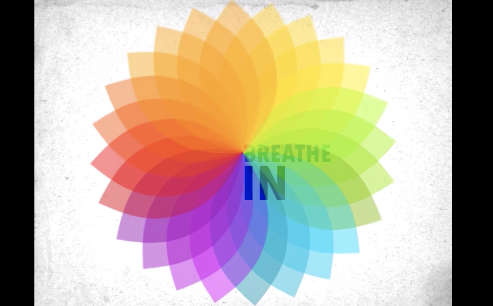
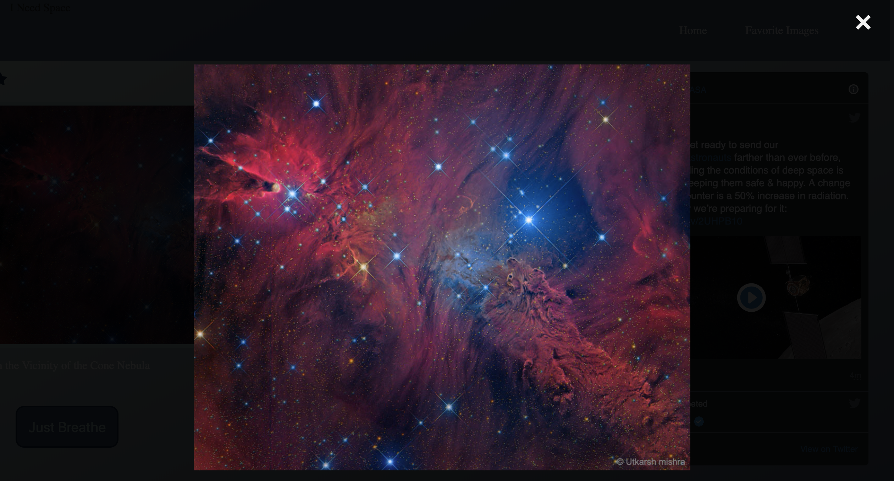

# I Need Space

This was my last solo project of my time at Turing School of Software and Design.
I was tasked to make an app in 5 days and consume the NASA API https://api.nasa.gov/index.html.
As soon as I got the assignment I was super excited, my child had beed loving space for the last few months and so I had a lot of excitement about it.
Few months back I bought said child (who is autistic) a shirt that said "I NEED SPACE" with galaxies and starts behind it and I instantly thought that would be the prefect name for this little app of mine, and so it was settled: "I Need My Space" was born.

This App lets you see the selected space picture of the day, all the tweets from NASA twitter and it can allow you to search pictures from the NASA pictures database. You are also allowed to favorite the pictures of the day you love and in case you actually need some space from you busy life, you have access to a "Just Breathe" button that allows you to follow a breathing exercise.

In the future I would love to be able to implement more customization and add more search features.

## Deployment instructions

This app is deployed on https://maddyg91.github.io/INeedSpace-FE/home

Here are some pictures of I Need My Space:

## Home

## Favorites Page

## Just Breathe

## Picture of the Day

## Authors

**[Maddie Jones](https://github.com/maddyg91)**
